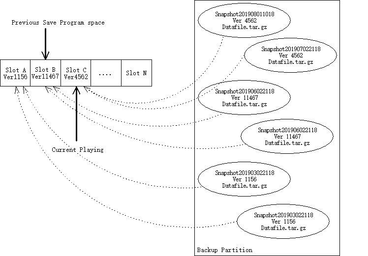
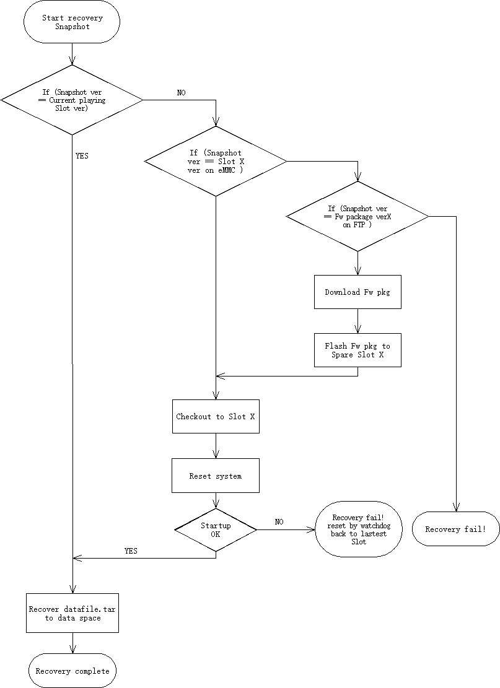

:dlang: en
:library: Asciidoctor
ifdef::asciidoctor[]
:source-highlighter: coderay
endif::asciidoctor[]

ifeval::["{dlang}" == "zh"]
= RAU 快照功能介绍

<<<

endif::[]
ifeval::["{dlang}" == "en"]
= RAU Snapshot Introduction

<<<

endif::[]

ifeval::["{dlang}" == "zh"]

快照的主要任务是保存程序区内容，和数据区内容。

endif::[]
ifeval::["{dlang}" == "en"]

The main work of the snapshot is to save the `Program Unit` and `Data Unit`.

endif::[]

ifeval::["{dlang}" == "zh"]
=== 程序区

所有程序固件统称，主要包含
endif::[]
ifeval::["{dlang}" == "en"]
=== Program Unit

"Program Unit" is all of firmware collectively contains:

endif::[]

* FPGA bitstream
* Platform support package (OS, HAL )
* Application software ( OAM, All service )

ifeval::["{dlang}" == "zh"]

以上所有程序的package会统一release版本，所有release都会上传到FTP。
只有进行升级操作会改变程序区内容，其他时间相当于只读状态，
升级操作前自动创建一次快照。
endif::[]
ifeval::["{dlang}" == "en"]

All above program will release the version together as a package.
All version pkg will upload FTP.

Only the upgrade operation can be change the program unit partition,
Usually it is read only.

A snapshot will automatically created before a upgrade request.

endif::[]

ifeval::["{dlang}" == "zh"]
=== 数据区

数据区包含：
endif::[]

ifeval::["{dlang}" == "en"]
=== User Data Unit

The data unit contains:
endif::[]

* User config data
* Database
* Temp patch file
* etc.

ifeval::["{dlang}" == "zh"]
=== 其他

以下部分不随快照进行备份和恢复。
endif::[]

ifeval::["{dlang}" == "en"]
=== Other Unit

The following parts does not backup and restore with snapshots.
endif::[]

* Data on QSPI Flash
** Bootloader ( read only )
** U-Boot Environment ( Double backup, Self-circulation )
** OTP area ( MAC address, Hardware Calibration measurement data, factory one time promgram )
* Log data

ifeval::["{dlang}" == "zh"]
== 创建快照

拍快照时，数据区无条件copy一份，并记录程序区的版本信息。如果没有升级，程序区没有变的情况下创建多个快照，即版本相同，则只保存一份程序，不会多次复制，只保存版本信息。

当创建快照时，检测当前程序区版本，记录当前程序区版本，连同数据区一起打包，用时间命名为快照文件，存放到快照分区。
endif::[]
ifeval::["{dlang}" == "en"]
== Create Snapshot

The snapshot contains the complete data unit and the ver code of the program unit.
When a snapshot created , data unit do a copy , and mark program unit ver code which playing on the RAU at present, then write into snapshot package file.

If have no upgrade request after the previous snapshot, the program unit ver code of the two snapshots are same.
Two snapshots point to the same slot, only one copy of this ver program on the flash.
endif::[]

ifeval::["{dlang}" == "zh"]
== 恢复快照

恢复快照时，先检测程序区版本，如果本地slot有存档，切到版本对应的slot，重启，然后把datafile覆盖到数据区。

如果没有，去FTP上检查是否存在该版本，如果存在下载，将下载下来的程序固件刷到空闲的slot或覆盖最老一个slot，重启，然后把datafile覆盖到数据区。
endif::[]
ifeval::["{dlang}" == "en"]
== Restore Snapshot

When a restore snapshot operation have start:

1. Check the program ver which marked in the snapshot.
2. If equal to the current slot ver which playing at present, recovery of data unit directly.
3. If not, check other slot ver, whether it is the same with slot ?
4. If not, check the ver on ftp.

The second step is to restore the data unit , will overwrite the datafile to the data unit partition.

endif::[]

== FAQ

ifeval::["{dlang}" == "zh"]
==== _Q:_ 如何来保证数据区对程序区的依赖？

_A:_ 按程序版本对应。
endif::[]
ifeval::["{dlang}" == "en"]
==== _Q:_ How to ensure data unit depend on Program ？

_A:_ Using unique software version code ( Hash or MD5) .
endif::[]

ifeval::["{dlang}" == "zh"]
==== _Q:_ 我们如何来保证程序区的数据安全？

_A:_ 程序单元的数据安全由多重备份的升级机制来保护。
请参考
Please refer to https://boundarydevices.com/using-swupdate-upgrade-system/[Double Copy]
endif::[]
ifeval::["{dlang}" == "en"]
==== _Q:_ How to protection the Program Unit and ensure the correctness ?

_A:_ The storage of the program unit is protected by the upgrade processing mechanism ,we using multiple copy solution.

Please refer to https://boundarydevices.com/using-swupdate-upgrade-system/[Double Copy]
endif::[]

ifeval::["{dlang}" == "zh"]
==== _Q:_ 快照包含哪些内容？

_A:_ 数据区的完整copy，日期信息，拍照时程序区的版本信息，以及所在的slot号。
主要容量为数据区容量，大概为20MB～30MB。
endif::[]
ifeval::["{dlang}" == "en"]
==== _Q:_ What does the snapshot contain ?

_A:_ Complete copy of the data unit,
date information,
Ver info of the program unit when creation time,
and the slot number where it previous local on.

The main capacity is the data unit capacity,
it is about 20MB to 30MB.
endif::[]

ifeval::["{dlang}" == "zh"]
==== _Q:_ 为什么不备份程序区内容？

_A:_ 不是没有备份，只是备份条件不一样，程序区的备份条件是程序有变动。

而程序区有变动的唯一条件是升级操作。

所以只有升级操作才会产生出程序区的完整副本。

数据区变动比较频繁，而程序区内容变动频率比较小，程序区不变的时候，程序区的内容也是安全的。

省去了备份程序区的动作，也快照操作更高效。
endif::[]
ifeval::["{dlang}" == "en"]
==== _Q:_ Why not copy the Program Unit ?

_A:_  Copy program unit trigger condition is different with data unit.

The only possible of changes the program unit is upgrade.

So only the upgrade will trigger a complete copy of the program unit.

The data unit changes more frequent than the program unit.

Skip the step of copy the program unit, snapshot operations are more efficient.

endif::[]

ifeval::["{dlang}" == "zh"]
==== _Q:_ 为什么允许让多个快照对应同一个程序区slot？

_A:_ 为了节省空间。

一个完整的程序区备份所需的空间是576MB，也就是一个slot需要576MB的空间，4GB的eMMC Flash，最多分配6个slot，这还没算数据区，数据区和数据区的备份也会占用空间。

所以理论上最大的slot个数不超过5个，建议个数为3个，目前我们现有的是2个，也就是双重备份。

我们可以修改支持3重或多重备份，slot的个数需要提前确定，以后不能随意更改，因为这需要重新规划分区。由于复杂程度增加，我们需要花费更多的时间。
endif::[]
ifeval::["{dlang}" == "en"]
==== _Q:_ Why allowed many snapshots share the same slot ?

_A:_ In order to save storage device space.

The space required for a complete program unit copy is 576MB,
So a slot needs 576MB .
We have 4GB eMMC Flash, store up to 6 slot.

The data unit is not included yet . Data unit and copy of data unit also
take capacity.

So the maximum number of slots is no more than 5.
The recommended number is 3.
At present, we use have slot, that is, double backup.

We can support 3 or more slots.
The number of slots needs to be determined in advance and cannot be changed at will, because it need re-planning partition.

As the complexity increases, we need to spend more time.

endif::[]

ifeval::["{dlang}" == "zh"]
==== _Q:_ 如果slot个数是3，快照也只能拍3个吗

_A:_ slot个数与快照个数无关。
slot个数是指板子上最大能保存程序区备份的个数，不意味着快照的个数。
快照的个数由保存快照的分区限制，slot越少，剩余能留给保存快照分区的容量就越多。
假设保存快照的分区容量为512MB，我们估算的一个快照大概为20MB～30MB，那么设备上最多能够保存16～20个快照。
endif::[]
ifeval::["{dlang}" == "en"]
==== _Q:_ If the number of slots is 3, how many snapshots can I create?

_A:_ The number of slots is independent of the number of snapshots.
slots number is the maximum number of program unit copy that can be saved on the board,
not equal to the number of snapshots.

The number of snapshots is limited by the partition where the snapshot is storage in,
Less slots the more capacity left to save the snapshot.

If the size of partition which for snapshots is 512MB large.
A snapshot is about 20MB to 30MB big,
then the storage device can keep in 16 to 20 snapshots.

endif::[]

ifeval::["{dlang}" == "zh"]
==== _Q:_ 快照为什么不保存日志数据？

_A:_ 日志有自己的备份条件，根据日期自己备份，根据容量自己循环。

快照和日志都有时间戳，可以根据时间戳查看对应日志。
endif::[]
ifeval::["{dlang}" == "en"]
==== _Q:_ Why not copy log data ?

_A:_ Log backup is independent.

Backup by setting time. or packed after it reaching a capacity.

endif::[]

